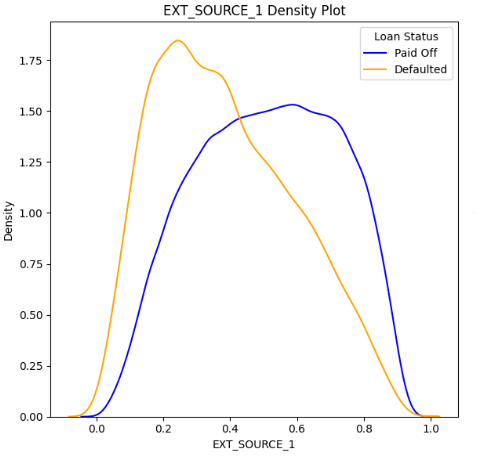
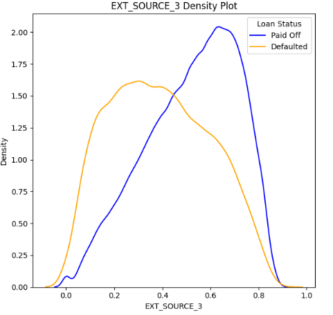
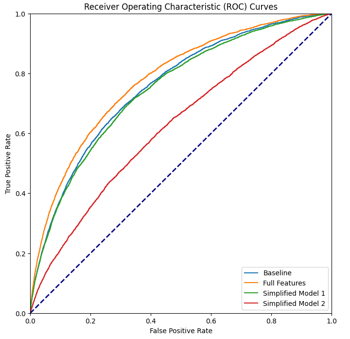
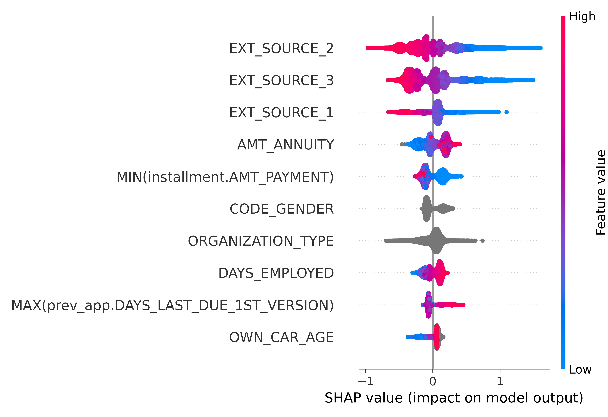
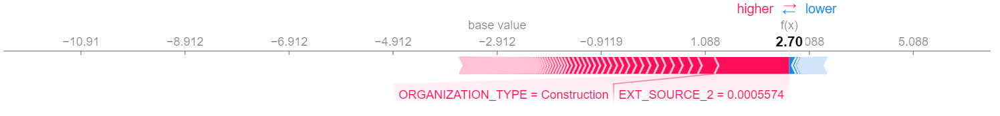
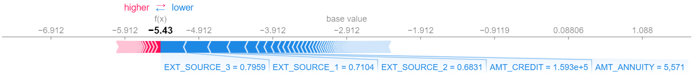

# HomeCredit Loan Default Prediction


___
The un-banked population by definition are people who do not have a current bank account and thus any credit history. According to "World Bank" the un-banked population currently is around 1.7 billion, this is a vast business opportunity to be explored by financial service providers.

Traditional financial services rely heavily on standard credit rating tools, thus not having a credit record is a major issue in evaluating risks associated with lending services. A robust and accurate method is needed to predict loan default probability with the non-standard financial data available.

## Dataset
The dataset for this project can be found on [Kaggle](https://www.kaggle.com/competitions/home-credit-default-risk)

The data is provided by Home Credit, a service dedicated to provided lines of credit (loans) to the un-banked population. The dataset is split into 7 tables: 1 containing loan application data and 6 others containing historical financial data for existing customers from Credit Bureau and Home Credit records.

## Objectives
  
  The main objective of this project is:

To develop a system that will be able to accurately predict probability of new loan defaulting during application process.

To achieve this objective, it was further broken down into the following 5 technical sub-objectives:

>1. To perform in-depth exploratory data analysis of the dataset
>2. To engineer new predictive features from historical data available in the dataset
>3. To develop a supervised machine learning model to predict loan default probability
>4. To evaluate and interpret trained classification models for business transparency
>5. To create an API endpoint for the trained model and deploy it

## Main Insights

Exploratory data analysis was performed on Application table from the dataset only. This is the main data store for information being supplied for loan applications, the rest of the dataset tables store historical financial records and depending on the customer might not have any records.
___
>- There are 41 features in the Application table with more than 50% of values missing. Most of the features are related to real estate properties and are not applicable to >all of the customers.
>
>- The target Loan Default feature is heavily inbalanced with 91,9% of all issued loans being paid-off and remaining  8,1% defaulting
>
>- 90,5% of all loans issued are Cash Loans with the remaining 9.5% - Revolving Loans
>
>- Average customer is ~44 years old with 6,5 years or employment record

Scaled `EXTERNAL_SOURCE1`, `EXTERNAL_SOURCE_3` have best separability by target Loan Status feature with potential to be good features in prediction model:

  
___

All of the tested numerical and categorical features were deemed as significant with regards to the target feature due to large sample size. Association and Power analysis was performed with the following results:

 > - Weak `Cramer's V` association of `ORGANIZATION_TYPE` feature with `TARGET` feature
 > - Medium `Cohen's d` power of all `EXTERNAL_SOURCE` features with `TARGET` feature
 
Numerical features like `ANNUAL_INCOME`, `CREDIT_AMOUNT` and `ANNUITY_AMOUNT` are a mix of 4 different currencies and are difficult to interpret for exploratory analysis purposes.

## Feature Engineering

Feature engineering for the project was done using FeatureTools DFS(Deep Feature Synthesis) method. Dataset schema and table relationships were defined, a standard set of aggregations provided for synthetic feature engineering process. All features were joined in to main Application table by unique user IDs, resulting engineered feature matrix had 1247 features.

## Feature Selection

Feature selection process was done on a 10% sample from the full engineered feature matrix. Following steps were applied:

>1. Removal of highly null features (>95% threshold)
>2. Removal of single value(low variance) features
>3. Removal of highly correlated features (>95% threshold)
>4. Removal of features with feature importance <1 from the baseline LightGBM model

Resulting feature matrix had 372 features.

## Modelling and Model Selection

ROC-AUC metric was chosen for model evaluation due to inbalance in the target feature and equal importance of both classes. We care for both Type I and Type II errors, as predicting a false positive (Type I) error would result in loan not being issued due to to risk of default and potential profit not realized. Meanwhile false negatives (Type II) error would result in the loan being issued while the probability of the loan defaulting being high, the potential loss would result in whole or part-off the credit amount

>Baseline LightGBM model was fit on the application table data. A model with full engineered feature matrix
> was tuned using Optuna for maximized AUC metric.

Two simplified models were assembled and tuned using Optuna for maximized AUC metric:

>Model 1 - LightGBM classifier with top 10 features by importance including aggregated historical data
>Model 2 - LightGBM classifier with top 10 features by importance only from application table
___
### Results

All models were tuned and evaluated on validation holdout set (20% of the data) and final score set on test holdout set (20% of the data)


>Observable improvement on the tuned model with full set of useful features determined in the feature >selection process when compared to the baseline model. With the total of 375 application and aggregated >historical (bureau/previous_application) features the model achieved a slightly better ROC-AUC score. While >the simplified models achieved considerably lower scores, simplified model 2 with only top 10 features from >application table also performed considerably worse.
___


>ROC-AUC plot for all models show how each model performs across all thresholds. The shape is smooth 
>and almost identical for all models, with the only difference being offset from the dashed no-skill diagonal line.

>It is also visible where the full engineered feature tuned model is outperforming the Baseline model across the >thresholds.

The best performing model was a tuned __LightGBM classifier__ with __372__ features and following parameters:
```python
{
    "learning_rate": 0.11487465028744731,
    "num_leaves": 31,
    "subsample_for_bin": 23750,
    "n_estimators": 500,
    "colsample_bytree": 0.8461975088940412,
    "subsample": 0.9057826076741011,
    "max_depth": 3,
    "reg_alpha": 0.4205436027639481,
    "reg_lambda": 0.8663218853104716,
}
```
Best model ROC-AUC score on test portion of the dataset: __0.78__

## Model Explainability

#### Overall feature impact on predictions 


`EXTERNAL_SOURCE` features that were identified as most significant in our hypothesis testing and rated as most important by the model are the top 3 features in predicting loan default target. `AMT_ANNUITY`, `GENDER` and engineered `MIN.AMT_PAYMENT` features also seem to have moderate impact on model prediction. The rest of the features have significantly lower impact and are less important for the model while making predictions.

#### Individual predictions

Individual plots for highest prediction probability "correct" and lowest prediction probability "incorrect" predictions. This gives a slight insight which features contribute the most to correct and incorrect model predictions and where the model is making the highest probability mistakes.

>Prediction with highest correct probability


___
>Prediction with highest incorrect probability



*Note values in graphs displayed as log odds and not probabilities*


## Business Application


In its current form the model can be used in a supervised manner: Supplying the decision maker with probability of loan defaulting during the evaluation or tagging the loan applications with risk profiles before review.

To enable unsupervised classification the decision threshold of the model has to be set based on business metrics.
This would include values such as loan interest rates and average installments before default to calculate potential financial loss due to default, or potential profit loss due to false positive prediction. Once the metrics are set the model can be evaluated with different threshold for best risk to profit/loss ratio.

## Further improvements

- Feature selection refining with domain knowledge and legislation experts. Features which could introduce bias and/or discrimination of applicants.
- Determine model classification threshold with business metrics applied. This would include values such as loan interest rates and average installments before default to calculate potential financial loss due to default, or potential profit loss due to false positive prediction.
- Full tuned model should be deployed with existing historical data stored in feature storage for lookup

## Deployed model

Deployed demo model can be reached and tested:

>[Loan Default Model](https://default-risk-zw2kzwvbma-uc.a.run.app/docs#/default/predict_loan_status_evaluate_post)


## Validation

To recreate the analysis and models:

1. Clone this repository
2. Download dataset from [Kaggle](https://www.kaggle.com/competitions/home-credit-default-risk) to data folder
3. pip install requirements.txt
4. Run EDA.ipynb for Exploratory Data Analysis
5. Run Feature_engineering.ipynb 
6. Run Models.ipynb

## Authors

Vytautas Beinoravicius

## License

[MIT](https://choosealicense.com/licenses/mit/)

